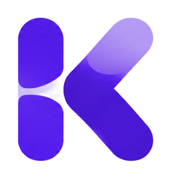

<!DOCTYPE html>
<html lang="es">
<head>
  <meta charset="UTF-8" />
  <meta name="viewport" content="width=device-width, initial-scale=1.0, maximum-scale=1.0, user-scalable=no" />
  <title>Korah</title>
  <link rel="icon" href="data:image/svg+xml,%3Csvg xmlns='http://www.w3.org/2000/svg' viewBox='0 0 64 64'%3E%3Crect width='64' height='64' rx='18' fill='%231e293b'/%3E%3Ctext x='32' y='42' text-anchor='middle' font-size='34' font-family='Arial,sans-serif' font-weight='800' fill='%23ffffff'%3EK%3C/text%3E%3C/svg%3E">
  <link rel="preconnect" href="https://fonts.googleapis.com">
  <link rel="preconnect" href="https://fonts.gstatic.com" crossorigin>
  <link href="https://fonts.googleapis.com/css2?family=Inter:wght@400;500;600;700;800&display=swap" rel="stylesheet">
  <link rel="stylesheet" href="css/styles.css?v=5.6-premium-modal-stripe-clean" />

  

  
</head>
<body>
  <section class="auth-screen hidden" id="authScreen">
    

      
<h1>Korah</h1>

      <h2 id="authTitle">Iniciar sesión</h2>
      
Entra para sincronizar tus pagos en todos tus dispositivos.

      <form id="authForm" class="auth-form">
        <label>Correo<input id="authEmail" type="email" required placeholder="tu@email.com" autocomplete="email" /></label>
        <label>Contraseña<input id="authPassword" type="password" required placeholder="••••••••" autocomplete="current-password" /></label>
        <label id="confirmPasswordField" class="hidden">Verificar contraseña<input id="authConfirmPassword" type="password" placeholder="••••••••" autocomplete="new-password" /></label>
        <label class="remember-row"><input id="rememberMe" type="checkbox" checked /> Mantener sesión iniciada</label>
        <button class="primary-btn auth-submit" type="submit" id="authSubmit">Iniciar sesión</button>
      </form>
      <button class="google-btn" id="googleLoginBtn" type="button">Continuar con Google</button>
      <button class="link-btn" id="toggleAuthMode" type="button">Crear cuenta nueva</button>
      

    

  </section>
  <aside class="sidebar hidden" id="sidebar">
    

      

        
        <h1>Korah</h1>
      

      <nav class="nav" id="desktopNav">
        <button class="nav-item active" data-view="dashboard"><svg viewBox="0 0 24 24"><path d="M4 4h7v7H4zM13 4h7v7h-7zM4 13h7v7H4zM13 13h7v7h-7z"/></svg>Dashboard</button>
        <button class="nav-item" data-view="history"><svg viewBox="0 0 24 24"><path d="M12 7v5l3 2M21 12a9 9 0 1 1-3-6.7M21 4v6h-6"/></svg>Historial</button>
        <button class="nav-item" data-view="reports"><svg viewBox="0 0 24 24"><path d="M5 19V9M12 19V5M19 19v-8M4 19h16"/></svg>Reportes</button>
        <button class="nav-item" data-view="premium"><svg viewBox="0 0 24 24"><path d="m12 3 3 6 6 .8-4.5 4.2 1.2 6-5.7-3-5.7 3 1.2-6L3 9.8 9 9l3-6Z"/></svg>Premium</button>
        <button class="nav-item" data-view="more"><svg viewBox="0 0 24 24"><path d="M5 12h.01M12 12h.01M19 12h.01"/></svg>Más</button>
      </nav>
    

    

      

        
♛

        <strong>Korah Premium</strong>
        
Obtén reportes avanzados, categorías personalizadas y más beneficios.

        <button type="button" data-view="premium">Conocer más ›</button>
      

      
<button class="user-card-main" type="button" data-view="account" aria-label="Mi cuenta">
E
<strong id="userName">Usuario</strong>›</button><button class="logout-btn" id="logoutBtn" type="button">Salir</button>

    

  </aside>

  <main class="app hidden" id="appShell">
    <header class="topbar">
      

        <h2>Dashboard</h2>
        
Hola, aquí tienes el resumen de tus pagos.

      

      
<button class="bell" aria-label="Notificaciones"><svg viewBox="0 0 24 24"><path d="M18 9a6 6 0 0 0-12 0c0 7-3 7-3 9h18c0-2-3-2-3-9ZM10 21h4"/></svg></button><button class="avatar account-avatar-btn" id="accountBtn" type="button" aria-label="Administrar cuenta">E</button>

    </header>
    <section class="view-screen" id="dashboardView">

    <section class="summary-grid">
      <article class="summary-card paid">
<svg viewBox="0 0 24 24"><path d="M20 7 10 17l-5-5"/></svg>

Pagado<strong id="totalPaid">$0</strong>
0 pagos

</article>
      <article class="summary-card pending">
<svg viewBox="0 0 24 24"><path d="M12 7v5l3 2M21 12a9 9 0 1 1-9-9"/></svg>

Pendiente<strong id="totalPending">$0</strong>
0 pagos

</article>
      <article class="summary-card overdue">
<svg viewBox="0 0 24 24"><path d="M6 4h12a2 2 0 0 1 2 2v12a2 2 0 0 1-2 2H6a2 2 0 0 1-2-2V6a2 2 0 0 1 2-2ZM4 9h16M8 3v4M16 3v4M12 12v4M12 18h.01"/></svg>

Vencidos<strong id="totalOverdue">$0</strong>
0 pagos

</article>
      <article class="summary-card total">
<svg viewBox="0 0 24 24"><path d="M4 8h16v10a2 2 0 0 1-2 2H6a2 2 0 0 1-2-2V8Zm3-4h10l3 4H4l3-4Zm11 9h-4"/></svg>

Total del mes<strong id="totalMonth">$0</strong>
0 pagos

</article>
    </section>

    <section class="panel">
      

        <h3>Mis pagos</h3>
        

          <select id="statusFilter">
            <option value="all">Todos</option>
            <option value="pending">Pendientes</option>
            <option value="paid">Pagados</option>
            <option value="overdue">Vencidos</option>
          </select>
          <button class="primary-btn" id="openModalBtn">＋ Agregar pago</button>
        

      

      

        
PagoFechaEstado

        <table>
          <thead>
            <tr>
              <th>Pago</th>
              <th>Frecuencia</th>
              <th>Monto</th>
              <th>Fecha límite</th>
              <th>Último pago</th>
              <th>Estado</th>
              <th class="edit-head" aria-label="Editar"></th>
            </tr>
          </thead>
          <tbody id="paymentsTable"></tbody>
        </table>
        

          <h3>No hay pagos todavía</h3>
          
Agrega tu primer pago recurrente para comenzar.

        

      

    </section>
    
ⓘ
Los pagos se reinician automáticamente según su frecuencia.

    </section>

    <section class="view-screen hidden" id="calendarView">
      

        

          <h3>Calendario</h3>
          
Organiza y visualiza tus pagos y vencimientos.

        

        

          <label class="calendar-month-select-wrap" aria-label="Seleccionar mes de calendario">
            <svg viewBox="0 0 24 24"><path d="M6 4h12a2 2 0 0 1 2 2v12a2 2 0 0 1-2 2H6a2 2 0 0 1-2-2V6a2 2 0 0 1 2-2ZM4 9h16M8 3v4M16 3v4"/></svg>
            <select id="calendarMonthSelect"></select>
          </label>
          <button class="secondary-btn" id="calendarTodayBtn" type="button">Hoy</button>
          <button class="ghost-nav" id="prevMonthBtn" type="button" aria-label="Mes anterior">‹</button>
          <button class="ghost-nav" id="nextMonthBtn" type="button" aria-label="Mes siguiente">›</button>
          <button class="primary-btn" id="calendarNewPaymentBtn" type="button">＋ Nuevo pago</button>
        

      

      <section class="next-payment-card" id="nextPaymentCard"></section>
      <section class="calendar-layout">
        <article class="calendar-card">
          

            <h3 id="calendarMonthLabel">Calendario</h3>
          

          

          

        </article>
        <aside class="day-payments-card">
          
<h3 id="selectedDayTitle">Pagos del día</h3>0

          

        </aside>
      </section>
      <section class="panel calendar-upcoming-panel">
        
<h3>Próximos pagos</h3><button class="link-btn calendar-see-all" type="button" data-view="dashboard">Ver todos</button>

        

      </section>
      
ⓘ
Con Premium puedes recibir recordatorios antes de cada vencimiento.
<button type="button" data-view="premium">Conocer más</button>

    </section>

    <section class="view-screen hidden" id="historyView">
      

        

        

          <label class="history-month-control" aria-label="Seleccionar mes de historial">
            <svg viewBox="0 0 24 24"><path d="M6 4h12a2 2 0 0 1 2 2v12a2 2 0 0 1-2 2H6a2 2 0 0 1-2-2V6a2 2 0 0 1 2-2ZM4 9h16M8 3v4M16 3v4"/></svg>
            <select id="historyMonthSelect"></select>
            <svg viewBox="0 0 24 24"><path d="m7 10 5 5 5-5"/></svg>
          </label>
          Este mes
        

      

      <section class="history-panel">
        

          <table class="history-table">
            <thead>
              <tr>
                <th>Concepto</th>
                <th>Fecha de pago</th>
                <th>Categoría</th>
                <th>Frecuencia</th>
                <th>Monto</th>
                <th></th>
              </tr>
            </thead>
            <tbody id="historyTable"></tbody>
          </table>
          

            <strong>Aún no hay pagos registrados</strong>
            
Cuando marques un pago como completado, aparecerá aquí.

          

        

        

          Mostrando 0 pagos
          
<button type="button">‹</button><button type="button" class="active">1</button><button type="button">›</button>

        

      </section>
    </section>

    <section class="view-screen hidden" id="reportsView">
      

        

        

          <label class="report-month-control" aria-label="Seleccionar mes de reportes">
            <svg viewBox="0 0 24 24"><path d="M6 4h12a2 2 0 0 1 2 2v12a2 2 0 0 1-2 2H6a2 2 0 0 1-2-2V6a2 2 0 0 1 2-2ZM4 9h16M8 3v4M16 3v4"/></svg>
            Junio de 2026
            <select id="reportMonthSelect"></select>
            <svg viewBox="0 0 24 24"><path d="m7 10 5 5 5-5"/></svg>
          </label>
          <button class="premium-mini-cta" type="button" data-view="premium">Premium</button>
        

      

      <section class="reports-metrics-grid">
        <article class="report-metric-card">
<svg viewBox="0 0 24 24"><path d="M4 8h16v10a2 2 0 0 1-2 2H6a2 2 0 0 1-2-2V8Zm3-4h10l3 4H4l3-4"/></svg>

Total gastado<strong id="reportTotalMonth">$0</strong>
Este mes

</article>
        <article class="report-metric-card">
<svg viewBox="0 0 24 24"><path d="M4 17 10 11l4 4 6-8M20 7v6h-6"/></svg>

Promedio mensual<strong id="reportAverageMonth">$0</strong>
Últimos meses

</article>
        <article class="report-metric-card">
<svg viewBox="0 0 24 24"><path d="M5 17 17 5M9 5h8v8"/></svg>

Mes más caro<strong id="reportExpensiveMonth">—</strong>
$0

</article>
        <article class="report-metric-card">
<svg viewBox="0 0 24 24"><path d="M5 7 17 19M17 11v8H9"/></svg>

Mes más barato<strong id="reportCheapMonth">—</strong>
$0

</article>
      </section>

      <section class="reports-analytics-grid">
        <article class="report-card category-card">
          
<h3>Gastos por categoría</h3>Mes actual

          

            
Total <strong>$0</strong>

            

          

        </article>
        <article class="report-card trend-card">
          
<h3>Evolución mensual</h3>6 meses

          

        </article>
        <article class="report-card compare-card">
          

            
<h3 id="compareTitle">Comparativa de meses</h3>
Compara el mes seleccionado contra otro periodo.

🔒
          

          

            <label>Mes actual<select id="compareMonthA"></select></label>
            vs
            <label>Comparar con<select id="compareMonthB"></select></label>
          

          

          
🔒Con Premium puedes comparar cualquier mes del historial.

        </article>
      </section>

      <article class="report-card export-card report-export-redesign">
        

          <h3>Exportar reporte</h3>
          
Descarga tu reporte del mes actual.

        

        

          <button type="button" class="export-option" id="exportPdfBtn">PDF<strong>Exportar PDF</strong><small>Disponible en Premium</small><i>🔒</i></button>
          <button type="button" class="export-option" id="exportExcelBtn">X<strong>Exportar Excel</strong><small>Disponible en Premium</small><i>🔒</i></button>
        

      </article>

      <section class="reports-premium-banner">
        
◇

        

          <h3>Desbloquea todo el poder de Korah Premium</h3>
          
✓ Historial ilimitado✓ Comparativas avanzadas✓ Exportar reportes✓ Notificaciones inteligentes

        

        <button class="white-premium-btn" type="button" data-view="premium">Actualizar a Premium</button>
        <small>Desde $49 MXN / mes</small>
      </section>
    </section>

    <section class="view-screen hidden" id="premiumView">
      <section class="premium-v4-hero">
        

          ✦ Korah Premium
          <h3>Desbloquea análisis avanzados para tomar el control</h3>
          
Accede a todas las herramientas Premium y lleva tus finanzas al siguiente nivel.

        

        

          

            Tu estado
            <strong data-premium-state-title>Plan Gratuito</strong>
            
Actualiza para desbloquear las herramientas avanzadas de Korah.

          

          <button type="button" class="primary-btn premium-v4-cta" data-premium-cta onclick="handlePremiumCta()">Actualizar a Premium</button>
        

      </section>

      <section class="premium-benefits-split">
        <article class="premium-why-panel">
          <h4>¿Por qué elegir Premium?</h4>
          

            
<i>✓</i> Acceso completo a tu historial sin límites

            
<i>✓</i> Exporta reportes en PDF y Excel

            
<i>✓</i> Análisis detallados de tus finanzas

            
<i>✓</i> Toma mejores decisiones con información clara

            
<i>✓</i> Comparativas para detectar cambios importantes

            
<i>✓</i> Soporte prioritario y nuevas funciones

          

        </article>

        

          <article>∞
<h4>Historial ilimitado</h4>
Consulta cualquier mes desde que comenzaste a usar Korah.

</article>
          <article>↗
<h4>Análisis financiero</h4>
Identifica categorías fuertes, variaciones y tendencias de gasto.

</article>
          <article>⇄
<h4>Comparativas</h4>
Compara meses para detectar aumentos o reducciones importantes.

</article>
        

      </section>

      <section class="premium-v4-note">
        
🔒

        
Estas herramientas te ayudan a entender mejor tus finanzas y a tomar el control de tu dinero.

      </section>
    </section>

    <section class="view-screen hidden" id="accountView">
      <section class="account-panel">
        

          Tu cuenta
          <h3>Mi cuenta</h3>
          
Administra tu correo, seguridad y datos de Korah.

        

        

          

            Plan actual
            <h3 id="accountPlanTitle">Free</h3>
            
Actualiza a Premium para desbloquear análisis avanzados.

          

          <button class="account-hero-action" id="manageSubscriptionBtn" type="button">Gestionar cuenta</button>
        

        

          <article class="account-card">
            <h4>Información</h4>
            
Correo electrónico<strong id="accountEmail">usuario@correo.com</strong>

            
Plan actual<strong id="accountPlan">Free</strong>

          </article>

          <article class="account-card">
            <h4>Contraseña</h4>
            
Cambia tu contraseña de acceso a Korah.

            <button class="outline-purple-btn" id="changePasswordBtn" type="button">Cambiar contraseña</button>
          </article>

          <article class="account-card danger-zone">
            <h4>Zona de riesgo</h4>
            
Borra todos tus pagos e historial para empezar desde cero.

            <button class="danger-btn" id="resetAccountDataBtn" type="button">Borrar toda mi información</button>
          </article>

          <article class="account-card">
            <h4>Sesión</h4>
            
Cierra tu sesión en este dispositivo.

            <button class="secondary-btn" id="accountLogoutBtn" type="button">Cerrar sesión</button>
          </article>
        

      </section>
    </section>

    <section class="view-screen hidden" id="moreView">
      

        

          
E

          

            <h3>Más</h3>
            
Administra tu cuenta y preferencias de Korah.

          

        

        

          <button class="more-menu-item" type="button" data-view="account"><strong>Mi cuenta</strong><small>Plan, correo y seguridad</small></button>
          <button class="more-menu-item" type="button"><strong>Categorías</strong><small>Organiza tus pagos</small></button>
          <button class="more-menu-item premium-link" type="button" data-view="premium"><strong>Premium</strong><small>Historial ilimitado y reportes</small></button>
          <button class="more-menu-item" type="button"><strong>Ayuda</strong><small>Soporte y preguntas frecuentes</small></button>
          <button class="more-menu-item danger" id="moreLogoutBtn" type="button"><strong>Cerrar sesión</strong><small>Salir de Korah en este dispositivo</small></button>
        

      

    </section>
  </main>

  <nav class="mobile-tabbar hidden" id="mobileTabbar" aria-label="Navegación móvil">
    <button class="active" data-view="dashboard"><svg viewBox="0 0 24 24"><path d="M4 4h7v7H4zM13 4h7v7h-7zM4 13h7v7H4zM13 13h7v7h-7z"/></svg>Dashboard</button>
    <button data-view="history"><svg viewBox="0 0 24 24"><path d="M12 7v5l3 2M21 12a9 9 0 1 1-3-6.7M21 4v6h-6"/></svg>Historial</button>
    <button data-view="reports"><svg viewBox="0 0 24 24"><path d="M5 19V9M12 19V5M19 19v-8M4 19h16"/></svg>Reportes</button>
    <button data-view="more"><svg viewBox="0 0 24 24"><path d="M5 12h.01M12 12h.01M19 12h.01"/></svg>Más</button>
  </nav>

  

    

    <form class="modal-card" id="paymentForm">
      
<h3 id="modalTitle">Nuevo pago</h3><button type="button" class="ghost-btn" data-close="payment">×</button>

      <input type="hidden" id="paymentId" />
      <label>Nombre del pago<input id="paymentName" required placeholder="Ej. BBVA Dorada" /></label>
      

        <label>Categoría<select id="paymentCategory" required><option>Tarjeta</option><option>Servicio</option><option>Suscripción</option><option>Renta</option><option>Seguro</option><option>Préstamo</option><option>Otro</option></select></label>
        <label>Frecuencia<select id="paymentFrequency" required><option value="monthly">Mensual</option><option value="bimonthly">Bimestral</option><option value="quarterly">Trimestral</option><option value="yearly">Anual</option></select></label>
      

      

        <label>Icono
          <input type="hidden" id="paymentIcon" value="credit-card" />
          

            <button type="button" class="icon-picker-trigger" id="iconPickerTrigger" aria-haspopup="true" aria-expanded="false">
              <svg viewBox="0 0 24 24"><path d="M4 7h16a2 2 0 0 1 2 2v8a2 2 0 0 1-2 2H4a2 2 0 0 1-2-2V9a2 2 0 0 1 2-2ZM2 11h20M6 15h5"/></svg>
              Tarjeta
              <svg viewBox="0 0 24 24"><path d="M6 9l6 6 6-6"/></svg>
            </button>
            

              <button type="button" class="icon-choice selected" data-icon="credit-card" aria-label="Tarjeta"><svg viewBox="0 0 24 24"><path d="M4 7h16a2 2 0 0 1 2 2v8a2 2 0 0 1-2 2H4a2 2 0 0 1-2-2V9a2 2 0 0 1 2-2ZM2 11h20M6 15h5"/></svg></button>
              <button type="button" class="icon-choice" data-icon="bolt" aria-label="Rayo"><svg viewBox="0 0 24 24"><path d="m13 2-9 12h7l-1 8 10-13h-7l0-7Z"/></svg></button>
              <button type="button" class="icon-choice" data-icon="drop" aria-label="Gota"><svg viewBox="0 0 24 24"><path d="M12 3s7 7 7 12a7 7 0 0 1-14 0c0-5 7-12 7-12Z"/></svg></button>
              <button type="button" class="icon-choice" data-icon="wifi" aria-label="Internet"><svg viewBox="0 0 24 24"><path d="M5 12.5a11 11 0 0 1 14 0M8 15.5a6.5 6.5 0 0 1 8 0M11 18.5a2 2 0 0 1 2 0M12 20h.01"/></svg></button>
              <button type="button" class="icon-choice" data-icon="play" aria-label="Streaming"><svg viewBox="0 0 24 24"><path d="M8 5v14l11-7L8 5Z"/></svg></button>
              <button type="button" class="icon-choice" data-icon="house" aria-label="Casa"><svg viewBox="0 0 24 24"><path d="M3 11 12 4l9 7M5 10v10h14V10M9 20v-6h6v6"/></svg></button>
              <button type="button" class="icon-choice" data-icon="heart" aria-label="Seguro"><svg viewBox="0 0 24 24"><path d="M12 21s-8-4.7-8-11a4.5 4.5 0 0 1 8-2.8A4.5 4.5 0 0 1 20 10c0 6.3-8 11-8 11Z"/></svg></button>
              <button type="button" class="icon-choice" data-icon="bank" aria-label="Banco"><svg viewBox="0 0 24 24"><path d="M4 18h16M6 18V9M10 18V9M14 18V9M18 18V9M3 9l9-5 9 5H3Z"/></svg></button>
              <button type="button" class="icon-choice" data-icon="phone" aria-label="Teléfono"><svg viewBox="0 0 24 24"><path d="M8 3h8a2 2 0 0 1 2 2v14a2 2 0 0 1-2 2H8a2 2 0 0 1-2-2V5a2 2 0 0 1 2-2ZM10 18h4"/></svg></button>
              <button type="button" class="icon-choice" data-icon="gas" aria-label="Gas"><svg viewBox="0 0 24 24"><path d="M12 3s5 4.6 5 9a5 5 0 0 1-10 0c0-2.1 1.2-3.8 2.7-5.4C10.2 9 12 10 12 12.5c1.5-1 2.4-2.7 2.4-4.4C14.4 5.9 12 3 12 3Z"/></svg></button>
              <button type="button" class="icon-choice" data-icon="car" aria-label="Auto"><svg viewBox="0 0 24 24"><path d="M12 21a9 9 0 1 0 0-18 9 9 0 0 0 0 18ZM12 15.5a3.5 3.5 0 1 0 0-7 3.5 3.5 0 0 0 0 7ZM12 3v5.5M12 15.5V21M3 12h5.5M15.5 12H21"/></svg></button>
              <button type="button" class="icon-choice" data-icon="cart" aria-label="Compras"><svg viewBox="0 0 24 24"><path d="M4 5h2l2 11h10l2-8H7M10 20h.01M18 20h.01"/></svg></button>
              <button type="button" class="icon-choice" data-icon="health" aria-label="Salud"><svg viewBox="0 0 24 24"><path d="M12 21s-7-4.5-7-10a4 4 0 0 1 7-2.6A4 4 0 0 1 19 11c0 5.5-7 10-7 10ZM12 9v6M9 12h6"/></svg></button>
              <button type="button" class="icon-choice" data-icon="education" aria-label="Educación"><svg viewBox="0 0 24 24"><path d="m3 8 9-4 9 4-9 4-9-4ZM6 10v5c0 2 3 4 6 4s6-2 6-4v-5"/></svg></button>
              <button type="button" class="icon-choice" data-icon="game" aria-label="Entretenimiento"><svg viewBox="0 0 24 24"><path d="M4 6h16a2 2 0 0 1 2 2v8a2 2 0 0 1-2 2H4a2 2 0 0 1-2-2V8a2 2 0 0 1 2-2ZM10 9v6l5-3-5-3Z"/></svg></button>
              <button type="button" class="icon-choice" data-icon="sparkle" aria-label="Otro"><svg viewBox="0 0 24 24"><path d="m12 3 1.8 5.2L19 10l-5.2 1.8L12 17l-1.8-5.2L5 10l5.2-1.8L12 3ZM19 15l.8 2.2L22 18l-2.2.8L19 21l-.8-2.2L16 18l2.2-.8L19 15Z"/></svg></button>
            

          

        </label>
        <label>Color
          <input type="hidden" id="paymentIconColor" value="blue" />
          

            <button type="button" class="color-dot blue selected" data-color="blue" aria-label="Azul"></button>
            <button type="button" class="color-dot green" data-color="green" aria-label="Verde"></button>
            <button type="button" class="color-dot orange" data-color="orange" aria-label="Naranja"></button>
            <button type="button" class="color-dot red" data-color="red" aria-label="Rojo"></button>
            <button type="button" class="color-dot purple" data-color="purple" aria-label="Morado"></button>
            <button type="button" class="color-dot slate" data-color="slate" aria-label="Gris"></button>
          

        </label>
      

      

        <label>Tipo de monto<select id="paymentAmountType"><option value="variable">Variable</option><option value="fixed">Fijo</option></select></label>
        <label id="paymentAmountField" class="hidden">Monto fijo<input id="paymentAmount" type="number" min="0" step="0.01" placeholder="0.00" /></label>
      

      

        <label>Día límite de pago<input id="paymentDueDay" type="number" min="1" max="31" required placeholder="15" /></label>
        <label>Último pago<input id="paymentLastPaid" type="date" /></label>
      

      
<button type="button" class="danger-btn hidden" id="deletePaymentBtn">Eliminar pago</button><button type="button" class="secondary-btn" data-close="payment">Cancelar</button><button type="submit" class="primary-btn">Guardar pago</button>

    </form>
  

  

    

    <form class="modal-card small" id="payForm">
      
<h3>Registrar pago</h3><button type="button" class="ghost-btn" data-close="pay">×</button>

      <input type="hidden" id="payId" />
      
Ingresa el monto pagado este mes.

      <label>Monto pagado<input id="payAmount" type="number" min="0" step="0.01" required placeholder="0.00" /></label>
      
<button type="button" class="secondary-btn" data-close="pay">Cancelar</button><button type="submit" class="primary-btn">Guardar pago</button>

    </form>
  

  

    

    <section class="subscription-card" role="dialog" aria-modal="true" aria-labelledby="subscriptionTitle">
      <button class="subscription-close" type="button" data-close="subscription" aria-label="Cerrar">×</button>
      Korah Premium
      <h3 id="subscriptionTitle">Gestionar suscripción</h3>
      
Consulta el estado de tu plan, renovación e historial de pagos.

      

        <article class="subscription-info-card">Plan actual<strong id="subscriptionPlan">Premium</strong></article>
        <article class="subscription-info-card">Estado<strong id="subscriptionStatus">Activa</strong></article>
        <article class="subscription-info-card">Inicio del periodo<strong id="subscriptionStart">—</strong></article>
        <article class="subscription-info-card">Renovación<strong id="subscriptionRenewal">—</strong></article>
      

      <article class="subscription-history">
        <h4>Historial de pagos</h4>
        

          Última suscripción activa
          <strong id="subscriptionHistoryText">Premium activo · Pago protegido por Stripe.</strong>
        

      </article>

      

        <button class="subscription-cancel-btn" id="cancelRenewalBtn" type="button">Cancelar renovación</button>
        <button class="subscription-primary-btn" type="button" data-close="subscription">Cerrar</button>
      

      

    </section>
  

  

    

    <section class="premium-plan-card" role="dialog" aria-modal="true" aria-labelledby="premiumPlanTitle">
      <button class="premium-plan-close" type="button" data-close="premium-plan" aria-label="Cerrar">×</button>
      Comparativa de planes
      <h3 id="premiumPlanTitle">Elige cómo quieres usar Korah</h3>
      
Empieza gratis o desbloquea Premium para entender mejor tus pagos, comparar meses y exportar reportes.

      

        <article class="plan-card free-plan">
          
Plan Free

          <h4>$0</h4>
          <small>MXN / mes</small>
          <ul>
            <li>Dashboard y pagos ilimitados</li>
            <li>Historial del mes actual y anterior</li>
            <li>Reporte del mes actual</li>
            <li>Comparativa básica automática</li>
          </ul>
          <button type="button" class="plan-secondary-btn" data-close="premium-plan">Continuar gratis</button>
        </article>

        <article class="plan-card premium-plan-option">
          
Korah Premium

          

            <button type="button" class="active" data-billing="monthly">Mensual</button>
            <button type="button" data-billing="annual">Anual</button>
          

          <h4 id="premiumPlanPrice">$19</h4>
          <small id="premiumPlanPeriod">MXN / mes</small>
          <ul>
            <li>Historial ilimitado</li>
            <li>Análisis financiero completo</li>
            <li>Comparativa de cualquier mes</li>
            <li>Exportar PDF y Excel</li>
            <li>Notificaciones inteligentes</li>
          </ul>
          <button type="button" class="plan-primary-btn" id="choosePremiumPlanBtn">Actualizar a Premium</button>
        </article>
      

      <button type="button" class="premium-plan-footer-close" data-close="premium-plan">Cerrar</button>
    </section>
  

  

  
  
Pago registrado

  
  
  

  

</body>
</html>
